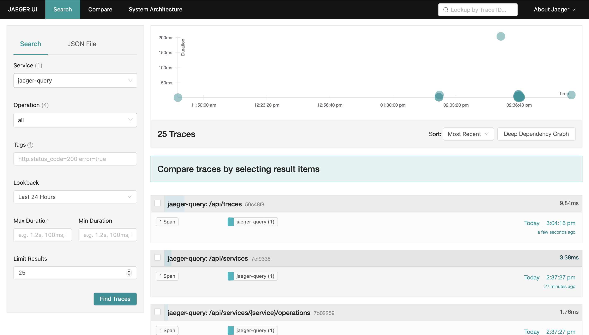
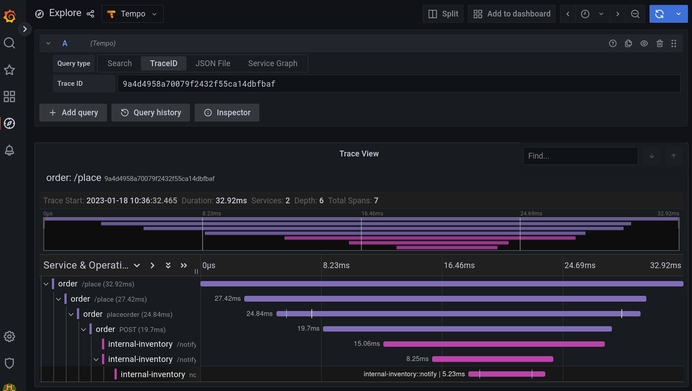

# Camel K Telemetry Trait

In this section you will find examples about fine-tuning your `Integration` using **Telemetry** `trait` capability.

The Telemetry trait can be used to automatically publish tracing information of interactions to an OTLP compatible collector.

## Configure and Setup OTLP collector

You can choose which distributed tracing tool you want to use as long as it offers a OTLP compatible collector.

### Configure and Setup Jaeger

Telemetry is compatible with Jaeger version 1.35+.

1. Enable Ingress addon in Minikube 

```sh
$ minikube addons enable ingress
```

2. Add Minikube IP to /etc/hosts:

```sh
$ echo "$(minikube ip) example.com" | sudo tee -a /etc/hosts
```

3. Make sure Jaeger operator is available (see https://www.jaegertracing.io/docs for installation details)

4. To use Jaeger, you can install the AllInOne image:

```sh
$ kubetcl apply -f jaeger-instance.yaml
```

5. Check the presence of the Jaeger instance

```sh
$ kubectl get jaeger
NAME        STATUS    VERSION   STRATEGY   STORAGE   AGE
instance   Running   1.40.0    allinone   memory    9m16s
```

### Configure and Setup OpenTelemetry

1. Enable Ingress addon in Minikube 

```sh
$ minikube addons enable ingress
```

2. Add Minikube IP to /etc/hosts:

```sh
$ echo "$(minikube ip) example.com" | sudo tee -a /etc/hosts
```

3. Make sure OpenTelemetry operator is available (see https://github.com/open-telemetry/opentelemetry-operator for installation details)

4. To use OpenTelemetry, you can deploy the OpenTelemetry Collector (otelcol) instance:

```sh
$ kubetcl apply -f otelcol-instance.yaml
```

5. Check the presence of the OTEL instance

```sh
$ kubectl get otelcol
NAME       MODE         VERSION   AGE
instance   deployment   0.67.0    37s
```

### Configure and Setup Grafana Tempo

1. Enable Ingress addon in Minikube 

```sh
$ minikube addons enable ingress
```

2. Add Minikube IP to /etc/hosts:

```sh
$ echo "$(minikube ip) example.com" | sudo tee -a /etc/hosts
```

3. Install Grafana

```sh
$ helm repo add grafana https://grafana.github.io/helm-charts
$ helm repo update
$ helm install grafana grafana/grafana
```

4. Install Grafana Tempo

```sh
$ helm install tempo grafana/tempo-distributed --set traces.otlp.grpc.enabled=true --set search.enabled=true --set traces.otlp.http.enabled=true
```

5. Check the presence of Tempo

```sh
$ kubectl get pods -l app.kubernetes.io/instance=tempo
NAME                                    READY   STATUS    RESTARTS   AGE
tempo-compactor-dcb77bcd8-89768         1/1     Running   0          8m48s
tempo-distributor-6d7fc99b57-tqph9      1/1     Running   0          8m48s
tempo-ingester-0                        1/1     Running   0          8m48s
tempo-ingester-1                        1/1     Running   0          8m48s
tempo-ingester-2                        1/1     Running   0          8m48s
tempo-memcached-0                       1/1     Running   0          8m48s
tempo-querier-75c4cc6587-8rtdv          1/1     Running   0          8m48s
tempo-query-frontend-748b58485d-hbkpb   1/1     Running   0          8m48s
```

The result may be different on your deployment.

6. Get your admin password and be sure to keep it :
```sh
kubectl get secret --namespace default grafana -o jsonpath="{.data.admin-password}" | base64 --decode ; echo
```

## Enable Telemetry and trace a REST API call in Camel K Route 

Tracing is an important approach for controlling and monitoring the experience of users. We  will be creating two distributed services: `Order` which is a rest service, and `Inventory` which is also a rest service.

Quarkus OpenTelemetry extension in Camel automatically creates a Camel OpenTelemetry tracer and binds it to the Camel registry. Simply declare the traits to enable telemetry tracing. 

* On **Jaeger** or **Opentelemetry**:

```sh
kamel run InventoryService.java --name inventory \
   -d camel-jackson \
   -t telemetry.enabled=true \
   -t telemetry.sampler=on \
   -t telemetry.endpoint=http://instance-collector:4317
```

* On **Grafana Tempo**:

```sh
kamel run InventoryService.java --name inventory \
   -d camel-jackson \
   -t telemetry.enabled=true \
   -t telemetry.sampler=on \
   -t telemetry.endpoint=http://tempo-distributor:4317
```

This will :
* enable tracing  
* send traces to OTLP API endpoint
* sample all traces


Let's inject the OpenTelemetry Tracer to the camel OrderService.java application. Let's start the inventory service. 


* On **Jaeger** or **Opentelemetry**:

```sh
kamel run OrderService.java --name order \
   -d camel-jackson \
   -t telemetry.enabled=true \
   -t telemetry.sampler=on \
   -t telemetry.service-name=external-order \
   -t telemetry.endpoint=http://instance-collector:4317
```

* On **Grafana Tempo**:

```sh
kamel run OrderService.java --name order \
   -d camel-jackson \
   -t telemetry.enabled=true \
   -t telemetry.sampler=on \
   -t telemetry.service-name=external-order \
   -t telemetry.endpoint=http://tempo-distributor:4317
```


If you are using Jaeger, you can omit the `telemetry.endpoint` parameter since camel-k automaticly discover Jaeger OTLP API endpoint.


You can make a few requests the REST Service with custom transaction values defined by curl, provided you made the `order` and `inventory` services available (using the **Service** trait is an easy way).

```sh
curl http://<order-service-external>/place -d '
{
    "orderId":58, 
    "itemId":12, 
    "quantity":1, 
    "orderItemName":"awesome item",
    "price":99
}' -v -H "Content-Type: application/json"
```

## View the traces

### Jaeger UI 

If you installed the Jaeger Operator as describred, you should be able to access Jaeger interface on minikube : http://example.com.

In the Jaeger interface we can see the details as:



### OpenTelemetry collector logs

If you installed the OpenTelemetry Operator as described, you should be able to see the traces in the collector logs :

```sh
kubectl logs -l app.kubernetes.io/name=instance-collector
```

### Grafana UI 

If you installed Grafana as descruved, you should be able to access Grafana interface easily on minikube :

```sh
$ kubectl expose service grafana --type=NodePort --target-port=3000 --name=grafana-np
service/grafana-np exposed
$ minikube service grafana-np
```

You need to add **Tempo** as a datasource. To configure it you need to define a URL in the datasource `http://tempo-query-frontend:3100`

In the Grafana interface we can see the details as:

